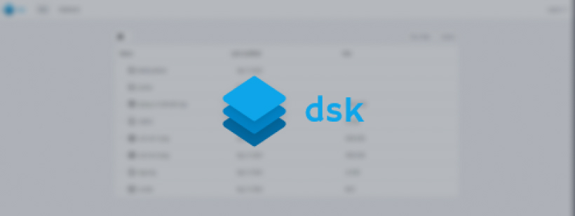

<p align="center">
  
</p>

# dsk - private file storage focused on shareability

## Gettings Started

### Instalation

1. Install required packages
   ```sh
   # using yarn 
   yarn
   
   # using npm 
   npm i

   # using pnpm
   pnpm i
   ```

2. Set up the environment variables

   - Rename `.env-example` to `.env` 

   - Change the default variables

     ```env
     # .env
     
     # Canonical URLs of your site
     NEXTAUTH_URL="http://localhost:3000"
     NEXT_PUBLIC_HOST="http://localhost:3000"
  
     # Access password
     DSK_PASSWORD="password"
  
     # JWT Secret for signing tokens, remember to change this and make   it long and unguessable
     AUTH_SECRET="secret"
     ```

3. Build and start the server
   ```sh
   yarn build && yarn start
   ```

### Notes

By default prisma uses `sqlite` as the default connector, you can change it by editing `prisma/schema.prisma`.

[More informations](https://www.prisma.io/docs/concepts/database-connectors)